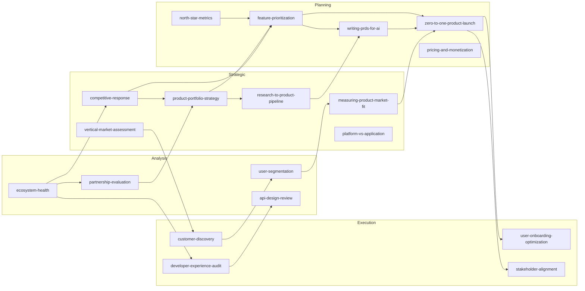

# PM Playbooks

**19 reusable PM skills for Claude Code** — repeatable decision-making workflows that produce structured artifacts (scorecards, frameworks, roadmaps) grounded in attributed insights from product leaders.


## Architecture

```
┌─────────────────────────────────────────────────────────────┐
│                     Your Company Repo                       │
│                                                             │
│  context/            .claude/skills/           applied/     │
│  ├── company/        ├── customer-discovery    ├── strategic│
│  ├── competitive/    ├── feature-prioritization├── planning │
│  ├── products/       ├── north-star-metrics    └── ...      │
│  ├── verticals/      ├── ... (19 skills)                    │
│  └── signals/        └── ... (+ company skills)             │
│       ▲                     │                      │        │
│       │                     ▼                      │        │
│  collectors/         skill-graph.yaml              │        │
│  (auto-refresh)      (dependency map)              │        │
│                                                             │
│  pm-playbooks/  ←── git submodule ──────────────────        │
└─────────────────────────────────────────────────────────────┘
```

## Quick Start

```bash
git clone https://github.com/ashstep2/pm-playbooks.git
cd pm-playbooks
# Open in Claude Code and invoke any skill by name
```

No configuration required. Skills work out of the box by asking for context interactively. Add a `context/` directory to ground outputs in your company's data.

## Why This Is Different

| | Generic prompts | Consulting frameworks | **pm-playbooks** |
|---|---|---|---|
| **Structured output** | Free-form text | PDF decks | Markdown artifacts with sections, tables, scorecards |
| **Attributed principles** | "Best practice says..." | Proprietary IP | Named sources with direct quotes and URLs |
| **Context-aware** | Starts from zero | Manual input | Reads `context/` directory, fills gaps conversationally |
| **Composable** | One-shot | Siloed engagements | Skills chain via `skill-graph.yaml` |
| **Evolving** | Static | Annual updates | `/learn` ingests new content, `/improve` reflects on runs |
| **Signal-fed** | No live data | Expensive research | Auto-collects from GitHub, HN, Reddit, news APIs |

## Skills

### Strategic — Deciding WHAT to build

| Skill | What It Produces |
|---|---|
| [product-portfolio-strategy](skills/product-portfolio-strategy/SKILL.md) | Multi-product roadmap + resource allocation across bets |
| [measuring-product-market-fit](skills/measuring-product-market-fit/SKILL.md) | PMF scorecard + signal tracking + pivot/persevere framework |
| [competitive-response](skills/competitive-response/SKILL.md) | Threat assessment + response playbook + moat analysis |
| [research-to-product-pipeline](skills/research-to-product-pipeline/SKILL.md) | Translation framework: research breakthroughs → shipped products |
| [platform-vs-application](skills/platform-vs-application/SKILL.md) | Build/buy/partner analysis + platform economics + ecosystem design |
| [vertical-market-assessment](skills/vertical-market-assessment/SKILL.md) | TAM/SAM/SOM + vertical prioritization matrix + entry strategy |

### Planning — Deciding HOW to build

| Skill | What It Produces |
|---|---|
| [zero-to-one-product-launch](skills/zero-to-one-product-launch/SKILL.md) | Launch checklist + channel strategy + success metrics + rollback plan |
| [feature-prioritization](skills/feature-prioritization/SKILL.md) | Weighted scoring matrix + sequenced roadmap + trade-off analysis |
| [pricing-and-monetization](skills/pricing-and-monetization/SKILL.md) | Pricing model analysis + willingness-to-pay + packaging strategy |
| [north-star-metrics](skills/north-star-metrics/SKILL.md) | Metric tree + leading/lagging indicators + dashboard design |
| [writing-prds-for-ai](skills/writing-prds-for-ai/SKILL.md) | PRD template + uncertainty handling + eval criteria for AI outputs |

### Execution — Building and shipping

| Skill | What It Produces |
|---|---|
| [customer-discovery](skills/customer-discovery/SKILL.md) | Interview guide + synthesis framework + discovery report |
| [developer-experience-audit](skills/developer-experience-audit/SKILL.md) | Friction scorecard + prioritized DX recommendations |
| [user-onboarding-optimization](skills/user-onboarding-optimization/SKILL.md) | Onboarding flow audit + activation metrics + improvement roadmap |
| [stakeholder-alignment](skills/stakeholder-alignment/SKILL.md) | RACI matrix + communication plan + research-product interface |

### Analysis — Measuring and learning

| Skill | What It Produces |
|---|---|
| [user-segmentation](skills/user-segmentation/SKILL.md) | Segment profiles + prioritization matrix + cross-segment insights |
| [ecosystem-health](skills/ecosystem-health/SKILL.md) | Ecosystem scorecard + benchmark comparison + growth playbook |
| [api-design-review](skills/api-design-review/SKILL.md) | Per-endpoint assessment + standards compliance + recommendations |
| [partnership-evaluation](skills/partnership-evaluation/SKILL.md) | Partner scorecards + deal structures + comparative assessment |

## Skill Dependency Graph

Skills feed into each other. After completing a skill, the system suggests what to run next based on [`skill-graph.yaml`](skill-graph.yaml).



## Installation

### Path A: Zero-Config (30 seconds)

```bash
git clone https://github.com/ashstep2/pm-playbooks.git
# Open in Claude Code → invoke any skill by name
```

Skills ask for context interactively. No setup required.

### Path B: Project Integration (5 minutes)

```bash
# From your project root
git submodule add https://github.com/ashstep2/pm-playbooks.git
bash pm-playbooks/scaffold/install.sh
```

This symlinks all 19 skills into `.claude/skills/` and generates a `CLAUDE.md` for your project.

### Path C: Full Company Setup (30 minutes)

```bash
git submodule add https://github.com/ashstep2/pm-playbooks.git
bash pm-playbooks/scaffold/install.sh

# Fill in company context
mkdir -p context/{company,competitive,products,verticals,founders,signals}
# Add markdown files to each directory (see scaffold/ for templates)

# Set up signal collectors (optional)
cp pm-playbooks/signals.yaml.example signals.yaml
# Edit signals.yaml, add API keys to .env
pip install pyyaml requests PyGithub praw
cd pm-playbooks && python3 -m collectors.run --config ../signals.yaml
```

### Graceful Degradation

Skills work at every level — more context produces more grounded output, but nothing breaks without it.

| Setup Level | Behavior |
|---|---|
| No `context/` | Skills ask for information interactively |
| Partial `context/` | Use what's available, ask for the rest |
| Full `context/` + signals | Fully grounded, no questions needed |

## Self-Improvement

Two meta-skills in `_meta/` help the system evolve:

- **`/learn`** — Ingest an article, podcast transcript, or book excerpt. Extracts insights, filters for novelty, and writes improvement proposals to `_meta/proposals/` for human review. Proposals are never auto-applied.
- **`/improve`** — Run after any skill to score its effectiveness (Instruction Clarity, Context Sufficiency, Artifact Usefulness) and propose one concrete improvement. Reflections accumulate in `applied/_reflections.md` and surface recurring patterns.

See [CONTRIBUTING.md](CONTRIBUTING.md) for how proposals become PRs.

## Signal Collectors

The `collectors/` framework auto-collects public data into `context/signals/`.

| Collector | Auth Required | What It Collects |
|---|---|---|
| `hackernews` | None | HN stories matching configured keywords |
| `github` | `GITHUB_TOKEN` | Repo stars, forks, issues, PRs for tracked repos |
| `reddit` | `REDDIT_CLIENT_ID` + `REDDIT_CLIENT_SECRET` | Posts from configured subreddits |
| `news` | `NEWS_API_KEY` | Articles from NewsAPI |

```bash
cd pm-playbooks && python3 -m collectors.run --config ../signals.yaml
```

Config lives in `signals.yaml` at your repo root. See `signals.yaml.example` for format.

## Skill Format

Each skill follows the [Anthropic Agent Skills spec](https://docs.anthropic.com/en/docs/agents-and-tools/agent-skills/overview). See [SKILL_FORMAT.md](SKILL_FORMAT.md) for the full reference. Skills include:

- **Core Principles** — attributed insights with direct quotes and source URLs
- **Instructions** — step-by-step workflow producing concrete artifacts
- **Diagnostic Questions** — assess the situation before diving in
- **Common Mistakes** — what PMs get wrong and how to avoid it
- **Context Integration** — how the skill uses company data

## Contributing

See [CONTRIBUTING.md](CONTRIBUTING.md) for how to add or improve skills.

## License

MIT
